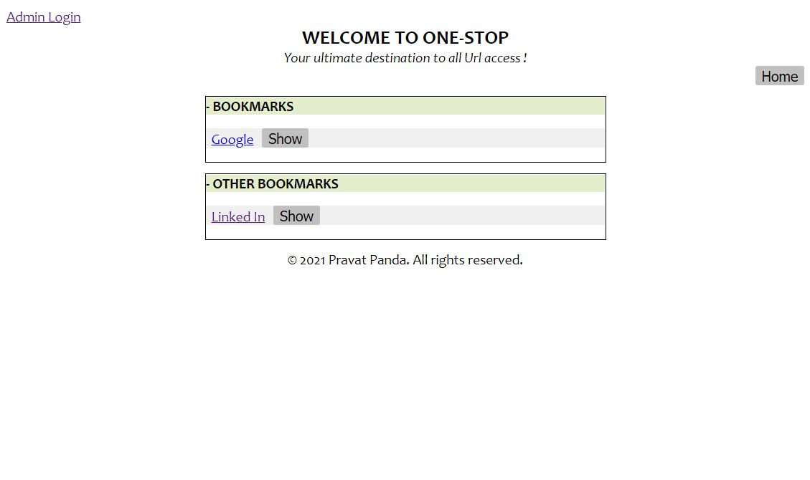
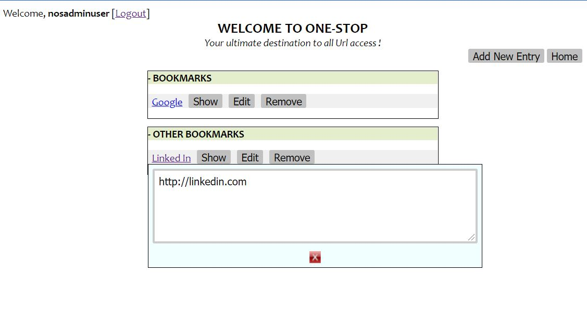
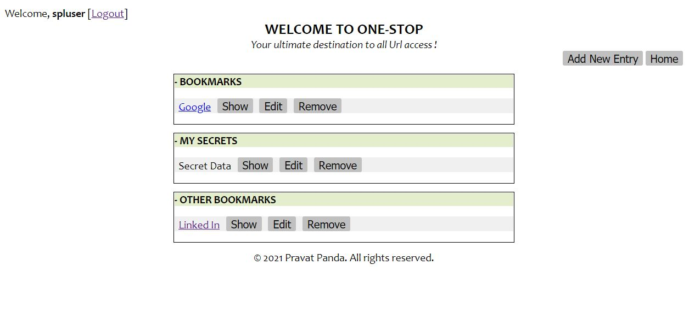
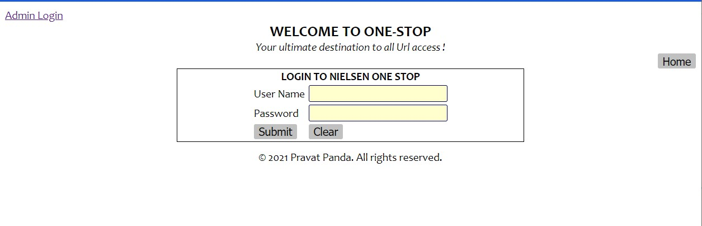
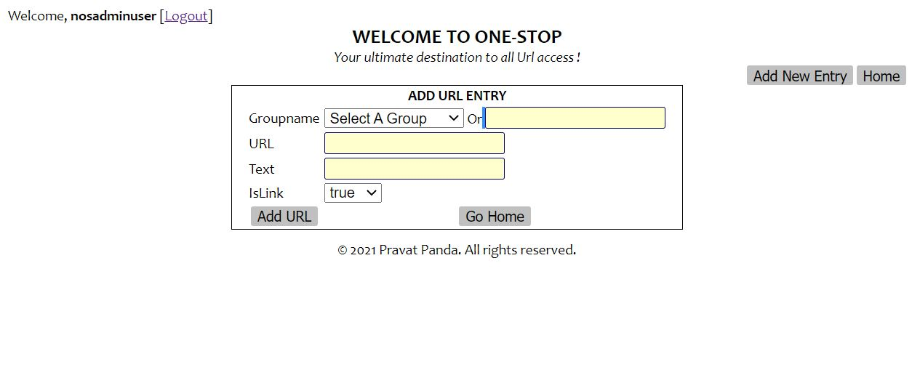

# One Stop

One stop is an application to bookmark all urls and much more

- Url Bookmarking - Bookmark Urls
- Data Storing - Keep track of any other data. e.g. A folder location, a todo thing etc..
- Secret data storing - A super user data that only the user can see

## User types
One stop support 2 user types
- User - No login required. Can see all the data created by admins and some data created by super admins. This user can not update/remove any data
- Admin - Can create/view the data that it has created and some data that the super admin has created. It can also edit/remove them.
- Super Admin - Can create data for all other users and it can also create some data that only the super admin can see and edit.

## Running the application
Checkout the code and run using ```mvn spring-boot:run``` command. Then hit url ```localhost:8080``` using your favorite browser
## Configurations
- Database : The application uses an in memory database, which gets deleted everytime the application is run. 
  A different permanent database can be used by changing the database configuration in the application.properties file.
```properties
spring.datasource.url=jdbc:h2:mem:testdb
spring.datasource.driverClassName=org.h2.Driver
spring.datasource.username=sa
spring.datasource.password=password
spring.jpa.database-platform=org.hibernate.dialect.H2Dialect
```
- User Type: The user names and passwords can be changed using the application.properties file
```properties
onestop.adminuser.name=admin
onestop.adminuser.pass=password
onestop.superuser.name=superadmin
onestop.superuser.pass=super-password
```
## Screenshots
###Main Screen - Default user

###Main Screen - Admin user

###Main Screen - Super user

###Login Screen

###Create/Edit Screen - Admin User

### Create/Edit Screen - Super User

